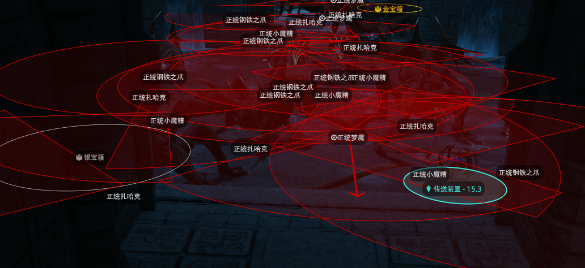

# Eureka Orthos Presets



基于 [Splatoon Presets List](https://github.com/cptjabberwock/SplatoonPresetsList/tree/main/Community%20Presets/Deep%20Dungeons/Eureka%20Orthos) 修改，参考 [NecroLens](https://github.com/RedAsteroid/NecroLens) 的风格的正统优雷卡 [Splatoon](https://github.com/PunishXIV/Splatoon) 预设。

## 功能

+ 怪物引战范围，巡逻怪指示箭头等
+ 宝箱、传送点标记
+ 玩家判定点

## 使用

将 [preset](./preset) 的文件内的脚本，导入到你的 Splatoon 中即可。

## 一键导入

导入到你的 Splatoon 中

```
~Lv2~{"Name":"正统优雷卡 雷达绘制","Group":"正统优雷卡","ZoneLockH":[1099,1100,1101,1102,1103,1104,1105,1106,1107,1108,1124],"ElementsL":[{"Name":"金宝箱","type":1,"radius":4.0,"color":3355498495,"Filled":false,"fillIntensity":0.5,"overlayTextColor":3355498495,"overlayVOffset":-0.2,"thicc":1.0,"overlayText":" 金宝箱","refActorDataID":2007358,"refActorComparisonType":3,"includeHitbox":true,"refActorTetherTimeMin":0.0,"refActorTetherTimeMax":0.0},{"Name":"银宝箱","type":1,"radius":4.0,"color":3233857736,"Filled":false,"fillIntensity":0.5,"overlayTextColor":3233857736,"overlayVOffset":-0.2,"thicc":1.0,"overlayText":" 银宝箱","refActorDataID":2007357,"refActorComparisonType":3,"includeHitbox":true,"refActorTetherTimeMin":0.0,"refActorTetherTimeMax":0.0},{"Name":"铜宝箱(拟态怪)","type":1,"radius":2.5,"color":4278190280,"fillIntensity":0.5,"overlayTextColor":4278190280,"overlayVOffset":-0.2,"thicc":1.0,"overlayText":"拟态怪","refActorDataID":2006020,"refActorComparisonType":3,"includeHitbox":true,"refActorTetherTimeMin":0.0,"refActorTetherTimeMax":0.0},{"Name":"铜宝箱2","type":1,"radius":2.5,"color":4279453067,"fillIntensity":0.5,"overlayTextColor":4279453067,"overlayText":" 铜宝箱","refActorDataID":1541,"refActorComparisonType":3,"includeHitbox":true,"refActorTetherTimeMin":0.0,"refActorTetherTimeMax":0.0},{"Name":"铜宝箱3","type":1,"radius":2.5,"color":4279453067,"fillIntensity":0.5,"overlayTextColor":4279453067,"overlayVOffset":-0.2,"overlayText":" 铜宝箱","refActorDataID":1542,"refActorComparisonType":3,"includeHitbox":true,"refActorTetherTimeMin":0.0,"refActorTetherTimeMax":0.0},{"Name":"铜宝箱4","type":1,"radius":2.5,"color":4279453067,"overlayTextColor":4279453067,"overlayVOffset":-0.2,"overlayText":" 铜宝箱","refActorDataID":1543,"refActorComparisonType":3,"includeHitbox":true,"refActorTetherTimeMin":0.0,"refActorTetherTimeMax":0.0},{"Name":"铜宝箱5","type":1,"radius":2.5,"color":4279453067,"overlayTextColor":4279453067,"overlayVOffset":-0.2,"overlayText":" 铜宝箱","refActorDataID":1544,"refActorComparisonType":3,"includeHitbox":true,"refActorTetherTimeMin":0.0,"refActorTetherTimeMax":0.0},{"Name":"铜宝箱6","type":1,"radius":2.5,"color":4279453067,"overlayTextColor":4279453067,"overlayVOffset":-0.2,"overlayText":" 铜宝箱","refActorDataID":1545,"refActorComparisonType":3,"includeHitbox":true,"refActorTetherTimeMin":0.0,"refActorTetherTimeMax":0.0},{"Name":"铜宝箱7","type":1,"radius":2.5,"color":4279453067,"overlayTextColor":4279453067,"overlayVOffset":-0.2,"overlayText":" 铜宝箱","refActorDataID":1546,"refActorComparisonType":3,"includeHitbox":true,"refActorTetherTimeMin":0.0,"refActorTetherTimeMax":0.0},{"Name":"铜宝箱8","type":1,"radius":2.5,"color":4279453067,"overlayTextColor":4279453067,"overlayVOffset":-0.2,"overlayText":" 铜宝箱","refActorDataID":1547,"refActorComparisonType":3,"includeHitbox":true,"refActorTetherTimeMin":0.0,"refActorTetherTimeMax":0.0},{"Name":"铜宝箱9","type":1,"radius":2.5,"color":4279453067,"overlayTextColor":4279453067,"overlayVOffset":-0.2,"overlayText":" 铜宝箱","refActorDataID":1548,"refActorComparisonType":3,"includeHitbox":true,"refActorTetherTimeMin":0.0,"refActorTetherTimeMax":0.0},{"Name":"铜宝箱10","type":1,"radius":2.5,"color":4279453067,"overlayTextColor":4279453067,"overlayVOffset":-0.2,"overlayText":" 铜宝箱","refActorDataID":1549,"refActorComparisonType":3,"includeHitbox":true,"refActorTetherTimeMin":0.0,"refActorTetherTimeMax":0.0},{"Name":"铜宝箱11","type":1,"radius":2.5,"color":4279453067,"overlayTextColor":4279453067,"overlayVOffset":-0.2,"overlayText":" 铜宝箱","refActorDataID":1551,"refActorComparisonType":3,"includeHitbox":true,"refActorTetherTimeMin":0.0,"refActorTetherTimeMax":0.0},{"Name":"铜宝箱12","type":1,"radius":2.5,"color":4279453067,"overlayTextColor":4279453067,"overlayVOffset":-0.2,"overlayText":" 铜宝箱","refActorDataID":1552,"refActorComparisonType":3,"includeHitbox":true,"refActorTetherTimeMin":0.0,"refActorTetherTimeMax":0.0},{"Name":"铜宝箱13","type":1,"radius":2.5,"color":4279453067,"overlayTextColor":4279453067,"overlayVOffset":-0.2,"overlayText":" 铜宝箱","refActorDataID":1553,"refActorComparisonType":3,"includeHitbox":true,"refActorTetherTimeMin":0.0,"refActorTetherTimeMax":0.0},{"Name":"铜宝箱14","type":1,"radius":2.5,"color":4279453067,"overlayTextColor":4279453067,"overlayVOffset":-0.2,"overlayText":" 铜宝箱","refActorDataID":1554,"refActorComparisonType":3,"includeHitbox":true,"refActorTetherTimeMin":0.0,"refActorTetherTimeMax":0.0},{"Name":"铜宝箱15","type":1,"radius":2.5,"color":4279453067,"overlayTextColor":4279453067,"overlayVOffset":-0.2,"overlayText":" 铜宝箱","refActorDataID":1550,"refActorComparisonType":3,"includeHitbox":true,"refActorTetherTimeMin":0.0,"refActorTetherTimeMax":0.0},{"Name":"玩家判定点","type":1,"radius":0.0,"color":4278190280,"fillIntensity":0.5,"thicc":2.6,"refActorType":1,"refActorTetherTimeMin":0.0,"refActorTetherTimeMax":0.0},{"Name":"传送装置","type":1,"radius":2.0,"color":4291878976,"fillIntensity":0.189,"overlayTextColor":4291878976,"overlayVOffset":-0.2,"overlayPlaceholders":true,"overlayText":" 传送装置 - $DISTANCE","refActorDataID":2013287,"refActorComparisonType":3,"includeRotation":true,"refActorTetherTimeMin":0.0,"refActorTetherTimeMax":0.0}],"MaxDistance":400.0,"UseDistanceLimit":true,"DistanceLimitType":1}
~Lv2~{"Name":"正统优雷卡 引战范围 精英怪","Group":"正统优雷卡","ZoneLockH":[1099,1100,1101,1102,1103,1104,1105,1106,1107,1108,1124],"ElementsL":[{"Name":"精英怪-拉米亚女王(视线)","type":4,"radius":10.0,"coneAngleMin":-45,"coneAngleMax":45,"color":4278190280,"fillIntensity":0.15,"overlayTextColor":4278190280,"overlayVOffset":-0.5,"thicc":1.0,"overlayText":"拉米亚女王","refActorTargetingYou":1,"refActorNPCNameID":12322,"refTargetYou":true,"refActorComparisonType":6,"includeHitbox":true,"includeRotation":true,"refActorTetherTimeMin":0.0,"refActorTetherTimeMax":0.0,"FillStep":15.0},{"Name":"精英怪-美拉西迪亚复制体(视线)","type":4,"radius":10.0,"coneAngleMin":-45,"coneAngleMax":45,"color":4278190280,"fillIntensity":0.15,"overlayTextColor":4278190280,"overlayVOffset":-0.5,"thicc":1.0,"overlayText":"美拉西迪亚复制体","refActorTargetingYou":1,"refActorNPCNameID":12323,"refTargetYou":true,"refActorComparisonType":6,"includeHitbox":true,"includeRotation":true,"refActorTetherTimeMin":0.0,"refActorTetherTimeMax":0.0,"FillStep":15.0},{"Name":"精英怪-亚灵智慧之灵(视线)","type":4,"radius":10.0,"coneAngleMin":-45,"coneAngleMax":45,"color":4278190280,"fillIntensity":0.15,"overlayTextColor":4278190280,"overlayVOffset":-0.5,"thicc":1.0,"overlayText":"亚灵智慧之灵","refActorTargetingYou":1,"refActorNPCNameID":12324,"refTargetYou":true,"refActorComparisonType":6,"includeHitbox":true,"includeRotation":true,"refActorTetherTimeMin":0.0,"refActorTetherTimeMax":0.0,"FillStep":15.0}],"MaxDistance":200.0,"UseDistanceLimit":true,"DistanceLimitType":1}
~Lv2~{"Name":"正统优雷卡 引战范围 1-10","Group":"正统优雷卡","ZoneLockH":[1099],"ElementsL":[{"Name":"正统梦魔(视线)","type":4,"radius":10.0,"coneAngleMin":-45,"coneAngleMax":45,"color":4278190280,"fillIntensity":0.1,"overlayVOffset":-0.5,"thicc":1.0,"overlayText":"正统梦魔","refActorTargetingYou":1,"refActorNPCNameID":12108,"refTargetYou":true,"refActorComparisonType":6,"includeHitbox":true,"includeRotation":true,"refActorTetherTimeMin":0.0,"refActorTetherTimeMax":0.0,"FillStep":15.0},{"Name":"正统小魔精(视线)","type":4,"radius":10.0,"coneAngleMin":-45,"coneAngleMax":45,"color":4278190280,"fillIntensity":0.1,"overlayVOffset":-0.5,"thicc":1.0,"overlayText":"正统小魔精","refActorTargetingYou":1,"refActorNPCNameID":12112,"refTargetYou":true,"refActorComparisonType":6,"includeHitbox":true,"includeRotation":true,"refActorTetherTimeMin":0.0,"refActorTetherTimeMax":0.0,"FillStep":15.0},{"Name":"正统扎哈克(视线)","type":4,"radius":10.0,"coneAngleMin":-45,"coneAngleMax":45,"color":4278190280,"fillIntensity":0.1,"overlayVOffset":-0.5,"thicc":1.0,"overlayText":"正统扎哈克","refActorTargetingYou":1,"refActorNPCNameID":12111,"refTargetYou":true,"refActorComparisonType":6,"includeHitbox":true,"includeRotation":true,"refActorTetherTimeMin":0.0,"refActorTetherTimeMax":0.0,"FillStep":15.0},{"Name":"正统榴弹怪(视线)","type":4,"radius":10.0,"coneAngleMin":-45,"coneAngleMax":45,"color":4278190280,"fillIntensity":0.1,"overlayVOffset":-0.5,"thicc":1.0,"overlayText":"正统榴弹怪","refActorTargetingYou":1,"refActorNPCNameID":12110,"refTargetYou":true,"refActorComparisonType":6,"includeHitbox":true,"includeRotation":true,"refActorTetherTimeMin":0.0,"refActorTetherTimeMax":0.0,"FillStep":15.0},{"Name":"正统恶魔(视线)","type":4,"radius":10.0,"coneAngleMin":-45,"coneAngleMax":45,"color":4278190280,"fillIntensity":0.1,"overlayVOffset":-0.5,"thicc":1.0,"overlayText":"正统恶魔","refActorTargetingYou":1,"refActorNPCNameID":12113,"refTargetYou":true,"refActorComparisonType":6,"includeHitbox":true,"includeRotation":true,"refActorTetherTimeMin":0.0,"refActorTetherTimeMax":0.0,"FillStep":15.0},{"Name":"正统贝希摩斯(视线)","type":4,"radius":10.0,"coneAngleMin":-45,"coneAngleMax":45,"color":4278190280,"fillIntensity":0.1,"overlayVOffset":-0.5,"thicc":1.0,"overlayText":"正统贝希摩斯","refActorTargetingYou":1,"refActorNPCNameID":12109,"refTargetYou":true,"refActorComparisonType":6,"includeHitbox":true,"includeRotation":true,"refActorTetherTimeMin":0.0,"refActorTetherTimeMax":0.0,"FillStep":15.0},{"Name":"正统幽鬼之眼(视线)","type":4,"radius":10.0,"coneAngleMin":-45,"coneAngleMax":45,"color":4278190280,"fillIntensity":0.1,"overlayVOffset":-0.5,"thicc":1.0,"overlayText":"正统幽鬼之眼","refActorTargetingYou":1,"refActorNPCNameID":12114,"refTargetYou":true,"refActorComparisonType":6,"includeHitbox":true,"includeRotation":true,"refActorTetherTimeMin":0.0,"refActorTetherTimeMax":0.0,"FillStep":15.0},{"Name":"正统尸龙(视线)","type":4,"radius":10.0,"coneAngleMin":-45,"coneAngleMax":45,"color":4278190280,"fillIntensity":0.1,"overlayVOffset":-0.5,"thicc":1.0,"overlayText":"正统尸龙","refActorTargetingYou":1,"refActorNPCNameID":12106,"refTargetYou":true,"refActorComparisonType":6,"includeHitbox":true,"includeRotation":true,"refActorTetherTimeMin":0.0,"refActorTetherTimeMax":0.0,"FillStep":15.0},{"Name":"正统瓦沙克(视线)","type":4,"radius":10.0,"coneAngleMin":-45,"coneAngleMax":45,"color":4278190280,"fillIntensity":0.1,"overlayVOffset":-0.5,"thicc":1.0,"overlayText":"正统瓦沙克","refActorTargetingYou":1,"refActorNPCNameID":12115,"refTargetYou":true,"refActorComparisonType":6,"includeHitbox":true,"includeRotation":true,"refActorTetherTimeMin":0.0,"refActorTetherTimeMax":0.0,"FillStep":15.0},{"Name":"正统浮灵(声音)","type":1,"radius":10.0,"color":3590365384,"fillIntensity":0.1,"overlayVOffset":-0.5,"thicc":1.0,"overlayText":"正统浮灵","refActorTargetingYou":1,"refActorNPCNameID":12116,"refTargetYou":true,"refActorComparisonType":6,"includeHitbox":true,"refActorTetherTimeMin":0.0,"refActorTetherTimeMax":0.0},{"Name":"正统塔纳托斯(声音)","type":1,"radius":10.0,"color":3590365384,"fillIntensity":0.1,"overlayVOffset":-0.5,"thicc":1.0,"overlayText":"正统塔纳托斯","refActorTargetingYou":1,"refActorNPCNameID":12107,"refTargetYou":true,"refActorComparisonType":6,"includeHitbox":true,"refActorTetherTimeMin":0.0,"refActorTetherTimeMax":0.0},{"Name":"正统钢铁之爪(距离)","type":1,"radius":10.0,"color":4278190280,"fillIntensity":0.1,"overlayVOffset":-0.5,"thicc":1.0,"overlayText":"正统钢铁之爪","refActorTargetingYou":1,"refActorNPCNameID":12117,"refTargetYou":true,"refActorComparisonType":6,"includeHitbox":true,"refActorTetherTimeMin":0.0,"refActorTetherTimeMax":0.0},{"Name":"正统水元精(距离)","type":1,"radius":10.0,"color":4278190280,"fillIntensity":0.1,"overlayVOffset":-0.5,"thicc":1.0,"overlayText":"正统水元精","refActorTargetingYou":1,"refActorNPCNameID":12118,"refTargetYou":true,"refActorComparisonType":6,"includeHitbox":true,"refActorTetherTimeMin":0.0,"refActorTetherTimeMax":0.0},{"Name":"正统瓦沙克(巡逻怪箭头)","type":3,"offX":9.0,"radius":0.0,"color":4278190280,"Filled":false,"fillIntensity":0.3,"thicc":3.0,"refActorNPCNameID":12115,"refActorComparisonType":6,"includeRotation":true,"LineEndB":1,"AdditionalRotation":4.712389,"refActorTetherTimeMin":0.0,"refActorTetherTimeMax":0.0,"FillStep":15.0},{"Name":"正统幽鬼之眼(巡逻怪箭头)","type":3,"offX":9.0,"radius":0.0,"color":4278190280,"Filled":false,"fillIntensity":0.3,"thicc":3.0,"refActorNPCNameID":12114,"refActorComparisonType":6,"includeRotation":true,"LineEndB":1,"AdditionalRotation":4.712389,"refActorTetherTimeMin":0.0,"refActorTetherTimeMax":0.0,"FillStep":15.0},{"Name":"正统梦魔(巡逻怪箭头)","type":3,"offX":9.0,"radius":0.0,"color":4278190280,"Filled":false,"fillIntensity":0.3,"thicc":3.0,"refActorNPCNameID":12108,"refActorComparisonType":6,"includeRotation":true,"LineEndB":1,"AdditionalRotation":4.712389,"refActorTetherTimeMin":0.0,"refActorTetherTimeMax":0.0,"FillStep":15.0}],"MaxDistance":200.0,"UseDistanceLimit":true,"DistanceLimitType":1}
~Lv2~{"Name":"正统优雷卡 引战范围 11-20","Group":"正统优雷卡","ZoneLockH":[1100],"ElementsL":[{"Name":"正统螺旋藻(视线)","type":4,"radius":10.0,"coneAngleMin":-45,"coneAngleMax":45,"color":4278190280,"fillIntensity":0.1,"overlayVOffset":-0.5,"thicc":1.0,"overlayText":"正统螺旋藻","refActorTargetingYou":1,"refActorNPCNameID":12129,"refTargetYou":true,"refActorComparisonType":6,"includeHitbox":true,"includeRotation":true,"refActorTetherTimeMin":0.0,"refActorTetherTimeMax":0.0,"FillStep":15.0},{"Name":"正统大魔界花(视线)","type":4,"radius":10.0,"coneAngleMin":-45,"coneAngleMax":45,"color":4278190280,"fillIntensity":0.1,"overlayVOffset":-0.5,"thicc":1.0,"overlayText":"正统大魔界花","refActorTargetingYou":1,"refActorNPCNameID":12130,"refTargetYou":true,"refActorComparisonType":6,"includeHitbox":true,"includeRotation":true,"refActorTetherTimeMin":0.0,"refActorTetherTimeMax":0.0,"FillStep":15.0},{"Name":"正统胜利(视线)","type":4,"radius":10.0,"coneAngleMin":-45,"coneAngleMax":45,"color":4278190280,"fillIntensity":0.1,"overlayVOffset":-0.5,"thicc":1.0,"overlayText":"正统胜利","refActorTargetingYou":1,"refActorNPCNameID":12128,"refTargetYou":true,"refActorComparisonType":6,"includeHitbox":true,"includeRotation":true,"refActorTetherTimeMin":0.0,"refActorTetherTimeMax":0.0,"FillStep":15.0},{"Name":"正统王冠(视线)","type":4,"radius":10.0,"coneAngleMin":-45,"coneAngleMax":45,"color":4278190280,"fillIntensity":0.1,"overlayVOffset":-0.5,"thicc":1.0,"overlayText":"正统王冠","refActorTargetingYou":1,"refActorNPCNameID":12125,"refTargetYou":true,"refActorComparisonType":6,"includeHitbox":true,"includeRotation":true,"refActorTetherTimeMin":0.0,"refActorTetherTimeMax":0.0,"FillStep":15.0},{"Name":"正统剧毒美人(视线)","type":4,"radius":10.0,"coneAngleMin":-45,"coneAngleMax":45,"color":4278190280,"fillIntensity":0.1,"overlayVOffset":-0.5,"thicc":1.0,"overlayText":"正统剧毒美人","refActorTargetingYou":1,"refActorNPCNameID":12131,"refTargetYou":true,"refActorComparisonType":6,"includeHitbox":true,"includeRotation":true,"refActorTetherTimeMin":0.0,"refActorTetherTimeMax":0.0,"FillStep":15.0},{"Name":"正统士兵(视线)","type":4,"radius":10.0,"coneAngleMin":-45,"coneAngleMax":45,"color":4278190280,"fillIntensity":0.1,"overlayVOffset":-0.5,"thicc":1.0,"overlayText":"正统士兵","refActorTargetingYou":1,"refActorNPCNameID":12122,"refTargetYou":true,"refActorComparisonType":6,"includeHitbox":true,"includeRotation":true,"refActorTetherTimeMin":0.0,"refActorTetherTimeMax":0.0,"FillStep":15.0},{"Name":"正统大王花(视线)","type":4,"radius":10.0,"coneAngleMin":-45,"coneAngleMax":45,"color":4278190280,"fillIntensity":0.1,"overlayVOffset":-0.5,"thicc":1.0,"overlayText":"正统大王花","refActorTargetingYou":1,"refActorNPCNameID":12126,"refTargetYou":true,"refActorComparisonType":6,"includeHitbox":true,"includeRotation":true,"refActorTetherTimeMin":0.0,"refActorTetherTimeMax":0.0,"FillStep":15.0},{"Name":"正统猎手(视线)","type":4,"radius":10.0,"coneAngleMin":-45,"coneAngleMax":45,"color":4278190280,"fillIntensity":0.1,"overlayVOffset":-0.5,"thicc":1.0,"overlayText":"正统猎手","refActorTargetingYou":1,"refActorNPCNameID":12119,"refTargetYou":true,"refActorComparisonType":6,"includeHitbox":true,"includeRotation":true,"refActorTetherTimeMin":0.0,"refActorTetherTimeMax":0.0,"FillStep":15.0},{"Name":"正统锯齿花(视线)","type":4,"radius":10.0,"coneAngleMin":-45,"coneAngleMax":45,"color":4278190280,"fillIntensity":0.1,"overlayVOffset":-0.5,"thicc":1.0,"overlayText":"正统锯齿花","refActorTargetingYou":1,"refActorNPCNameID":12127,"refTargetYou":true,"refActorComparisonType":6,"includeHitbox":true,"includeRotation":true,"refActorTetherTimeMin":0.0,"refActorTetherTimeMax":0.0,"FillStep":15.0},{"Name":"正统坐镇巨像(视线)","type":4,"radius":10.0,"coneAngleMin":-45,"coneAngleMax":45,"color":4278190280,"fillIntensity":0.1,"overlayVOffset":-0.5,"thicc":1.0,"overlayText":"正统坐镇巨像","refActorTargetingYou":1,"refActorNPCNameID":12124,"refTargetYou":true,"refActorComparisonType":6,"includeHitbox":true,"includeRotation":true,"refActorTetherTimeMin":0.0,"refActorTetherTimeMax":0.0,"FillStep":15.0},{"Name":"正统树木巨像(视线)","type":4,"radius":10.0,"coneAngleMin":-45,"coneAngleMax":45,"color":4278190280,"fillIntensity":0.1,"overlayVOffset":-0.5,"thicc":1.0,"overlayText":"正统树木巨像","refActorTargetingYou":1,"refActorNPCNameID":12123,"refTargetYou":true,"refActorComparisonType":6,"includeHitbox":true,"includeRotation":true,"refActorTetherTimeMin":0.0,"refActorTetherTimeMax":0.0,"FillStep":15.0},{"Name":"正统微型系统(距离)","type":1,"radius":10.0,"color":4278190280,"fillIntensity":0.1,"overlayVOffset":-0.5,"thicc":1.0,"overlayText":"正统微型系统","refActorTargetingYou":1,"refActorNPCNameID":12121,"refTargetYou":true,"refActorComparisonType":6,"includeHitbox":true,"refActorTetherTimeMin":0.0,"refActorTetherTimeMax":0.0},{"Name":"正统系统β(距离)","type":1,"radius":10.0,"color":4278190280,"fillIntensity":0.1,"overlayVOffset":-0.5,"thicc":1.0,"overlayText":"正统系统β","refActorTargetingYou":1,"refActorNPCNameID":12120,"refTargetYou":true,"refActorComparisonType":6,"includeHitbox":true,"refActorTetherTimeMin":0.0,"refActorTetherTimeMax":0.0},{"Name":"正统树木巨像(巡逻怪箭头)","type":3,"offX":9.0,"radius":0.0,"color":4278190280,"Filled":false,"fillIntensity":0.3,"thicc":3.0,"refActorNPCNameID":12123,"refActorComparisonType":6,"includeRotation":true,"LineEndB":1,"AdditionalRotation":4.712389,"refActorTetherTimeMin":0.0,"refActorTetherTimeMax":0.0,"FillStep":15.0},{"Name":"正统坐镇巨像(巡逻怪箭头)","type":3,"offX":9.0,"radius":0.0,"color":4278190280,"Filled":false,"fillIntensity":0.3,"thicc":3.0,"refActorNPCNameID":12124,"refActorComparisonType":6,"includeRotation":true,"LineEndB":1,"AdditionalRotation":4.712389,"refActorTetherTimeMin":0.0,"refActorTetherTimeMax":0.0,"FillStep":15.0},{"Name":"正统王冠(巡逻怪箭头)","type":3,"offX":9.0,"radius":0.0,"color":4278190280,"Filled":false,"fillIntensity":0.3,"thicc":3.0,"refActorNPCNameID":12125,"refActorComparisonType":6,"includeRotation":true,"LineEndB":1,"AdditionalRotation":4.712389,"refActorTetherTimeMin":0.0,"refActorTetherTimeMax":0.0,"FillStep":15.0}],"MaxDistance":200.0,"UseDistanceLimit":true,"DistanceLimitType":1}
~Lv2~{"Name":"正统优雷卡 引战范围 21-30","Group":"正统优雷卡","ZoneLockH":[1101],"ElementsL":[{"Name":"正统双足飞龙(视线)","type":4,"radius":10.0,"coneAngleMin":-45,"coneAngleMax":45,"color":4278190280,"fillIntensity":0.1,"overlayVOffset":-0.5,"thicc":1.0,"overlayText":"正统双足飞龙","refActorTargetingYou":1,"refActorNPCNameID":12139,"refTargetYou":true,"refActorComparisonType":6,"includeHitbox":true,"includeRotation":true,"refActorTetherTimeMin":0.0,"refActorTetherTimeMax":0.0,"FillStep":15.0},{"Name":"正统布罗宾雅克(视线)","type":4,"radius":10.0,"coneAngleMin":-45,"coneAngleMax":45,"color":4278190280,"fillIntensity":0.1,"overlayVOffset":-0.5,"thicc":1.0,"overlayText":"正统布罗宾雅克","refActorTargetingYou":1,"refActorNPCNameID":12142,"refTargetYou":true,"refActorComparisonType":6,"includeHitbox":true,"includeRotation":true,"refActorTetherTimeMin":0.0,"refActorTetherTimeMax":0.0,"FillStep":15.0},{"Name":"正统铁巨人(视线)","type":4,"radius":10.0,"coneAngleMin":-45,"coneAngleMax":45,"color":4278190280,"fillIntensity":0.1,"overlayVOffset":-0.5,"thicc":1.0,"overlayText":"正统铁巨人","refActorTargetingYou":1,"refActorNPCNameID":12135,"refTargetYou":true,"refActorComparisonType":6,"includeHitbox":true,"includeRotation":true,"refActorTetherTimeMin":0.0,"refActorTetherTimeMax":0.0,"FillStep":15.0},{"Name":"正统骑士(视线)","type":4,"radius":10.0,"coneAngleMin":-45,"coneAngleMax":45,"color":4278190280,"fillIntensity":0.1,"overlayVOffset":-0.5,"thicc":1.0,"overlayText":"正统骑士","refActorTargetingYou":1,"refActorNPCNameID":12133,"refTargetYou":true,"refActorComparisonType":6,"includeHitbox":true,"includeRotation":true,"refActorTetherTimeMin":0.0,"refActorTetherTimeMax":0.0,"FillStep":15.0},{"Name":"正统机甲(视线)","type":4,"radius":10.0,"coneAngleMin":-45,"coneAngleMax":45,"color":4278190280,"fillIntensity":0.1,"overlayVOffset":-0.5,"thicc":1.0,"overlayText":"正统机甲","refActorTargetingYou":1,"refActorNPCNameID":12134,"refTargetYou":true,"refActorComparisonType":6,"includeHitbox":true,"includeRotation":true,"refActorTetherTimeMin":0.0,"refActorTetherTimeMax":0.0,"FillStep":15.0},{"Name":"正统雷蛟(视线)","type":4,"radius":10.0,"coneAngleMin":-45,"coneAngleMax":45,"color":4278190280,"fillIntensity":0.1,"overlayVOffset":-0.5,"thicc":1.0,"overlayText":"正统雷蛟","refActorTargetingYou":1,"refActorNPCNameID":12137,"refTargetYou":true,"refActorComparisonType":6,"includeHitbox":true,"includeRotation":true,"refActorTetherTimeMin":0.0,"refActorTetherTimeMax":0.0,"FillStep":15.0},{"Name":"正统蓝龙(视线)","type":4,"radius":10.0,"coneAngleMin":-45,"coneAngleMax":45,"color":4278190280,"fillIntensity":0.1,"overlayVOffset":-0.5,"thicc":1.0,"overlayText":"正统蓝龙","refActorTargetingYou":1,"refActorNPCNameID":12140,"refTargetYou":true,"refActorComparisonType":6,"includeHitbox":true,"includeRotation":true,"refActorTetherTimeMin":0.0,"refActorTetherTimeMax":0.0,"FillStep":15.0},{"Name":"正统薇薇尔飞龙(视线)","type":4,"radius":10.0,"coneAngleMin":-45,"coneAngleMax":45,"color":4278190280,"fillIntensity":0.1,"overlayVOffset":-0.5,"thicc":1.0,"overlayText":"正统薇薇尔飞龙","refActorTargetingYou":1,"refActorNPCNameID":12141,"refTargetYou":true,"refActorComparisonType":6,"includeHitbox":true,"includeRotation":true,"refActorTetherTimeMin":0.0,"refActorTetherTimeMax":0.0,"FillStep":15.0},{"Name":"正统婆那罗(视线)","type":4,"radius":10.0,"coneAngleMin":-45,"coneAngleMax":45,"color":4278190280,"fillIntensity":0.1,"overlayVOffset":-0.5,"thicc":1.0,"overlayText":"正统婆那罗","refActorTargetingYou":1,"refActorNPCNameID":12143,"refTargetYou":true,"refActorComparisonType":6,"includeHitbox":true,"includeRotation":true,"refActorTetherTimeMin":0.0,"refActorTetherTimeMax":0.0,"FillStep":15.0},{"Name":"正统卡利亚(视线)","type":4,"radius":10.0,"coneAngleMin":-45,"coneAngleMax":45,"color":4278190280,"fillIntensity":0.1,"overlayVOffset":-0.5,"thicc":1.0,"overlayText":"正统卡利亚","refActorTargetingYou":1,"refActorNPCNameID":12136,"refTargetYou":true,"refActorComparisonType":6,"includeHitbox":true,"includeRotation":true,"refActorTetherTimeMin":0.0,"refActorTetherTimeMax":0.0,"FillStep":15.0},{"Name":"正统龟甲龙(视线)","type":4,"radius":10.0,"coneAngleMin":-45,"coneAngleMax":45,"color":4278190280,"fillIntensity":0.1,"overlayVOffset":-0.5,"thicc":1.0,"overlayText":"正统龟甲龙","refActorTargetingYou":1,"refActorNPCNameID":12144,"refTargetYou":true,"refActorComparisonType":6,"includeHitbox":true,"includeRotation":true,"refActorTetherTimeMin":0.0,"refActorTetherTimeMax":0.0,"FillStep":15.0},{"Name":"正统小龙(视线)","type":4,"radius":10.0,"coneAngleMin":-45,"coneAngleMax":45,"color":4278190280,"fillIntensity":0.1,"overlayVOffset":-0.5,"thicc":1.0,"overlayText":"正统小龙","refActorTargetingYou":1,"refActorNPCNameID":12138,"refTargetYou":true,"refActorComparisonType":6,"includeHitbox":true,"includeRotation":true,"refActorTetherTimeMin":0.0,"refActorTetherTimeMax":0.0,"FillStep":15.0},{"Name":"正统破坏者(距离)","type":1,"radius":10.0,"color":4278190280,"fillIntensity":0.1,"overlayVOffset":-0.5,"thicc":1.0,"overlayText":"正统破坏者","refActorTargetingYou":1,"refActorNPCNameID":12132,"refTargetYou":true,"refActorComparisonType":6,"includeHitbox":true,"refActorTetherTimeMin":0.0,"refActorTetherTimeMax":0.0},{"Name":"正统小龙(巡逻怪箭头)","type":3,"offX":9.0,"radius":0.0,"color":4278190280,"Filled":false,"fillIntensity":0.3,"thicc":3.0,"refActorNPCNameID":12138,"refActorComparisonType":6,"includeRotation":true,"LineEndB":1,"AdditionalRotation":4.712389,"refActorTetherTimeMin":0.0,"refActorTetherTimeMax":0.0,"FillStep":15.0},{"Name":"正统婆那罗(巡逻怪箭头)","type":3,"offX":9.0,"radius":0.0,"color":4278190280,"Filled":false,"fillIntensity":0.3,"thicc":3.0,"refActorNPCNameID":12143,"refActorComparisonType":6,"includeRotation":true,"LineEndB":1,"AdditionalRotation":4.712389,"refActorTetherTimeMin":0.0,"refActorTetherTimeMax":0.0,"FillStep":15.0},{"Name":"正统铁巨人(巡逻怪箭头)","type":3,"offX":9.0,"radius":0.0,"color":4278190280,"Filled":false,"fillIntensity":0.3,"thicc":3.0,"refActorNPCNameID":12135,"refActorComparisonType":6,"includeRotation":true,"LineEndB":1,"AdditionalRotation":4.712389,"refActorTetherTimeMin":0.0,"refActorTetherTimeMax":0.0,"FillStep":15.0}],"MaxDistance":200.0,"UseDistanceLimit":true,"DistanceLimitType":1}
~Lv2~{"Name":"正统优雷卡 引战范围 31-40","Group":"正统优雷卡","ZoneLockH":[1102],"ElementsL":[{"Name":"正统改造鸟人(视线)","type":4,"radius":10.0,"coneAngleMin":-45,"coneAngleMax":45,"color":4278190280,"fillIntensity":0.1,"overlayVOffset":-0.5,"thicc":1.0,"overlayText":"正统改造鸟人","refActorTargetingYou":1,"refActorNPCNameID":12154,"refTargetYou":true,"refActorComparisonType":6,"includeHitbox":true,"includeRotation":true,"refActorTetherTimeMin":0.0,"refActorTetherTimeMax":0.0,"FillStep":15.0},{"Name":"正统沙布提(视线)","type":4,"radius":10.0,"coneAngleMin":-45,"coneAngleMax":45,"color":4278190280,"fillIntensity":0.1,"overlayVOffset":-0.5,"thicc":1.0,"overlayText":"正统沙布提","refActorTargetingYou":1,"refActorNPCNameID":12153,"refTargetYou":true,"refActorComparisonType":6,"includeHitbox":true,"includeRotation":true,"refActorTetherTimeMin":0.0,"refActorTetherTimeMax":0.0,"FillStep":15.0},{"Name":"正统镜骑士(视线)","type":4,"radius":10.0,"coneAngleMin":-45,"coneAngleMax":45,"color":4278190280,"fillIntensity":0.1,"overlayVOffset":-0.5,"thicc":1.0,"overlayText":"正统镜骑士","refActorTargetingYou":1,"refActorNPCNameID":12149,"refTargetYou":true,"refActorComparisonType":6,"includeHitbox":true,"includeRotation":true,"refActorTetherTimeMin":0.0,"refActorTetherTimeMax":0.0,"FillStep":15.0},{"Name":"正统拉米亚(视线)","type":4,"radius":10.0,"coneAngleMin":-45,"coneAngleMax":45,"color":4278190280,"fillIntensity":0.1,"overlayVOffset":-0.5,"thicc":1.0,"overlayText":"正统拉米亚","refActorTargetingYou":1,"refActorNPCNameID":12157,"refTargetYou":true,"refActorComparisonType":6,"includeHitbox":true,"includeRotation":true,"refActorTetherTimeMin":0.0,"refActorTetherTimeMax":0.0,"FillStep":15.0},{"Name":"正统那迦(视线)","type":4,"radius":10.0,"coneAngleMin":-45,"coneAngleMax":45,"color":4278190280,"fillIntensity":0.1,"overlayVOffset":-0.5,"thicc":1.0,"overlayText":"正统那迦","refActorTargetingYou":1,"refActorNPCNameID":12155,"refTargetYou":true,"refActorComparisonType":6,"includeHitbox":true,"includeRotation":true,"refActorTetherTimeMin":0.0,"refActorTetherTimeMax":0.0,"FillStep":15.0},{"Name":"正统铁血战士(视线)","type":4,"radius":10.0,"coneAngleMin":-45,"coneAngleMax":45,"color":4278190280,"fillIntensity":0.1,"overlayVOffset":-0.5,"thicc":1.0,"overlayText":"正统铁血战士","refActorTargetingYou":1,"refActorNPCNameID":12147,"refTargetYou":true,"refActorComparisonType":6,"includeHitbox":true,"includeRotation":true,"refActorTetherTimeMin":0.0,"refActorTetherTimeMax":0.0,"FillStep":15.0},{"Name":"正统弥诺陶洛斯(视线)","type":4,"radius":10.0,"coneAngleMin":-45,"coneAngleMax":45,"color":4278190280,"fillIntensity":0.1,"overlayVOffset":-0.5,"thicc":1.0,"overlayText":"正统弥诺陶洛斯","refActorTargetingYou":1,"refActorNPCNameID":12150,"refTargetYou":true,"refActorComparisonType":6,"includeHitbox":true,"includeRotation":true,"refActorTetherTimeMin":0.0,"refActorTetherTimeMax":0.0,"FillStep":15.0},{"Name":"正统爬虫半人马(视线)","type":4,"radius":10.0,"coneAngleMin":-45,"coneAngleMax":45,"color":4278190280,"fillIntensity":0.1,"overlayVOffset":-0.5,"thicc":1.0,"overlayText":"正统爬虫半人马","refActorTargetingYou":1,"refActorNPCNameID":12151,"refTargetYou":true,"refActorComparisonType":6,"includeHitbox":true,"includeRotation":true,"refActorTetherTimeMin":0.0,"refActorTetherTimeMax":0.0,"FillStep":15.0},{"Name":"正统幻影光(视线)","type":4,"radius":10.0,"coneAngleMin":-45,"coneAngleMax":45,"color":4278190280,"fillIntensity":0.1,"overlayTextColor":3355471871,"overlayVOffset":-0.5,"thicc":1.0,"overlayText":"正统幻影光","refActorTargetingYou":1,"refActorNPCNameID":12148,"refTargetYou":true,"refActorComparisonType":6,"includeHitbox":true,"includeRotation":true,"refActorTetherTimeMin":0.0,"refActorTetherTimeMax":0.0,"FillStep":15.0},{"Name":"正统疫虫(声音)","type":1,"radius":10.0,"color":3590365384,"fillIntensity":0.1,"overlayVOffset":-0.5,"thicc":1.0,"overlayText":"正统疫虫","refActorTargetingYou":1,"refActorNPCNameID":12156,"refTargetYou":true,"refActorComparisonType":6,"includeHitbox":true,"refActorTetherTimeMin":0.0,"refActorTetherTimeMax":0.0},{"Name":"正统蜘蛛(声音)","type":1,"radius":10.0,"color":3590365384,"fillIntensity":0.1,"overlayVOffset":-0.5,"thicc":1.0,"overlayText":"正统蜘蛛","refActorTargetingYou":1,"refActorNPCNameID":12146,"refTargetYou":true,"refActorComparisonType":6,"includeHitbox":true,"refActorTetherTimeMin":0.0,"refActorTetherTimeMax":0.0},{"Name":"正统发条虫(距离)","type":1,"radius":10.0,"color":4278190280,"fillIntensity":0.1,"overlayVOffset":-0.5,"thicc":1.0,"overlayText":"正统发条虫","refActorTargetingYou":1,"refActorNPCNameID":12145,"refTargetYou":true,"refActorComparisonType":6,"includeHitbox":true,"refActorTetherTimeMin":0.0,"refActorTetherTimeMax":0.0},{"Name":"正统奇美拉(距离)","type":1,"radius":10.0,"color":4278190280,"fillIntensity":0.1,"overlayTextColor":3355471871,"overlayVOffset":-0.5,"thicc":1.0,"overlayText":"正统奇美拉","refActorTargetingYou":1,"refActorNPCNameID":12152,"refTargetYou":true,"refActorComparisonType":6,"includeHitbox":true,"refActorTetherTimeMin":0.0,"refActorTetherTimeMax":0.0,"FillStep":15.0},{"Name":"正统幻影光(巡逻怪箭头)","type":3,"offX":9.0,"radius":0.0,"color":4278190280,"Filled":false,"fillIntensity":0.3,"thicc":3.0,"refActorNPCNameID":12148,"refActorComparisonType":6,"includeRotation":true,"LineEndB":1,"AdditionalRotation":4.712389,"refActorTetherTimeMin":0.0,"refActorTetherTimeMax":0.0,"FillStep":15.0},{"Name":"正统那迦(巡逻怪箭头)","type":3,"offX":9.0,"radius":0.0,"color":4278190280,"Filled":false,"fillIntensity":0.3,"thicc":3.0,"refActorNPCNameID":12155,"refActorComparisonType":6,"includeRotation":true,"LineEndB":1,"AdditionalRotation":4.712389,"refActorTetherTimeMin":0.0,"refActorTetherTimeMax":0.0,"FillStep":15.0},{"Name":"正统镜骑士(巡逻怪箭头)","type":3,"offX":9.0,"radius":0.0,"color":4278190280,"Filled":false,"fillIntensity":0.3,"thicc":3.0,"refActorNPCNameID":12149,"refActorComparisonType":6,"includeRotation":true,"LineEndB":1,"AdditionalRotation":4.712389,"refActorTetherTimeMin":0.0,"refActorTetherTimeMax":0.0,"FillStep":15.0}],"MaxDistance":200.0,"UseDistanceLimit":true,"DistanceLimitType":1}
~Lv2~{"Name":"正统优雷卡 引战范围 41-50","Group":"正统优雷卡","ZoneLockH":[1103],"ElementsL":[{"Name":"正统胡瓦西(视线)","type":4,"radius":10.0,"coneAngleMin":-45,"coneAngleMax":45,"color":4278190280,"fillIntensity":0.1,"overlayVOffset":-0.5,"thicc":1.0,"overlayText":"正统胡瓦西","refActorTargetingYou":1,"refActorNPCNameID":12165,"refTargetYou":true,"refActorComparisonType":6,"includeHitbox":true,"includeRotation":true,"refActorTetherTimeMin":0.0,"refActorTetherTimeMax":0.0,"FillStep":15.0},{"Name":"正统阿刻戎(视线)","type":4,"radius":10.0,"coneAngleMin":-45,"coneAngleMax":45,"color":4278190280,"fillIntensity":0.1,"overlayVOffset":-0.5,"thicc":1.0,"overlayText":"正统阿刻戎","refActorTargetingYou":1,"refActorNPCNameID":12166,"refTargetYou":true,"refActorComparisonType":6,"includeHitbox":true,"includeRotation":true,"refActorTetherTimeMin":0.0,"refActorTetherTimeMax":0.0,"FillStep":15.0},{"Name":"正统阿巴伊(视线)","type":4,"radius":10.0,"coneAngleMin":-45,"coneAngleMax":45,"color":4278190280,"fillIntensity":0.1,"overlayVOffset":-0.5,"thicc":1.0,"overlayText":"正统阿巴伊","refActorTargetingYou":1,"refActorNPCNameID":12167,"refTargetYou":true,"refActorComparisonType":6,"includeHitbox":true,"includeRotation":true,"refActorTetherTimeMin":0.0,"refActorTetherTimeMax":0.0,"FillStep":15.0},{"Name":"正统魔石精(视线)","type":4,"radius":10.0,"coneAngleMin":-45,"coneAngleMax":45,"color":4278190280,"fillIntensity":0.1,"overlayVOffset":-0.5,"thicc":1.0,"overlayText":"正统魔石精","refActorTargetingYou":1,"refActorNPCNameID":12159,"refTargetYou":true,"refActorComparisonType":6,"includeHitbox":true,"includeRotation":true,"refActorTetherTimeMin":0.0,"refActorTetherTimeMax":0.0,"FillStep":15.0},{"Name":"正统赫德提特(视线)","type":4,"radius":10.0,"coneAngleMin":-45,"coneAngleMax":45,"color":4278190280,"fillIntensity":0.1,"overlayVOffset":-0.5,"thicc":1.0,"overlayText":"正统赫德提特","refActorTargetingYou":1,"refActorNPCNameID":12169,"refTargetYou":true,"refActorComparisonType":6,"includeHitbox":true,"includeRotation":true,"refActorTetherTimeMin":0.0,"refActorTetherTimeMax":0.0,"FillStep":15.0},{"Name":"正统凯尔派(视线)","type":4,"radius":10.0,"coneAngleMin":-45,"coneAngleMax":45,"color":4278190280,"fillIntensity":0.1,"overlayVOffset":-0.5,"thicc":1.0,"overlayText":"正统凯尔派","refActorTargetingYou":1,"refActorNPCNameID":12162,"refTargetYou":true,"refActorComparisonType":6,"includeHitbox":true,"includeRotation":true,"refActorTetherTimeMin":0.0,"refActorTetherTimeMax":0.0,"FillStep":15.0},{"Name":"正统古菩猩猩(视线)","type":4,"radius":10.0,"coneAngleMin":-45,"coneAngleMax":45,"color":4278190280,"fillIntensity":0.1,"overlayVOffset":-0.5,"thicc":1.0,"overlayText":"正统古菩猩猩","refActorTargetingYou":1,"refActorNPCNameID":12168,"refTargetYou":true,"refActorComparisonType":6,"includeHitbox":true,"includeRotation":true,"refActorTetherTimeMin":0.0,"refActorTetherTimeMax":0.0,"FillStep":15.0},{"Name":"正统库库尔坎(视线)","type":4,"radius":10.0,"coneAngleMin":-45,"coneAngleMax":45,"color":4278190280,"fillIntensity":0.1,"overlayVOffset":-0.5,"thicc":1.0,"overlayText":"正统库库尔坎","refActorTargetingYou":1,"refActorNPCNameID":12163,"refTargetYou":true,"refActorComparisonType":6,"includeHitbox":true,"includeRotation":true,"refActorTetherTimeMin":0.0,"refActorTetherTimeMax":0.0,"FillStep":15.0},{"Name":"正统明胶怪(视线)","type":4,"radius":10.0,"coneAngleMin":-45,"coneAngleMax":45,"color":4278190280,"fillIntensity":0.1,"overlayVOffset":-0.5,"thicc":1.0,"overlayText":"正统明胶怪","refActorTargetingYou":1,"refActorNPCNameID":12158,"refTargetYou":true,"refActorComparisonType":6,"includeHitbox":true,"includeRotation":true,"refActorTetherTimeMin":0.0,"refActorTetherTimeMax":0.0,"FillStep":15.0},{"Name":"正统霜狼(视线)","type":4,"radius":10.0,"coneAngleMin":-45,"coneAngleMax":45,"color":4278190280,"fillIntensity":0.1,"overlayVOffset":-0.5,"thicc":1.0,"overlayText":"正统霜狼","refActorTargetingYou":1,"refActorNPCNameID":12164,"refTargetYou":true,"refActorComparisonType":6,"includeHitbox":true,"includeRotation":true,"refActorTetherTimeMin":0.0,"refActorTetherTimeMax":0.0,"FillStep":15.0},{"Name":"正统山巨魔(距离)","type":1,"radius":10.0,"color":4278190280,"fillIntensity":0.1,"overlayVOffset":-0.5,"thicc":1.0,"overlayText":"正统山巨魔","refActorTargetingYou":1,"refActorNPCNameID":12160,"refTargetYou":true,"refActorComparisonType":6,"includeHitbox":true,"refActorTetherTimeMin":0.0,"refActorTetherTimeMax":0.0},{"Name":"正统土泥人(距离)","type":1,"radius":10.0,"color":4278190280,"fillIntensity":0.1,"overlayVOffset":-0.5,"thicc":1.0,"overlayText":"正统土泥人","refActorTargetingYou":1,"refActorNPCNameID":12170,"refTargetYou":true,"refActorComparisonType":6,"includeHitbox":true,"refActorTetherTimeMin":0.0,"refActorTetherTimeMax":0.0},{"Name":"正统阿帕斯(距离)","type":1,"radius":10.0,"color":4278190280,"fillIntensity":0.1,"overlayVOffset":-0.5,"thicc":1.0,"overlayText":"正统阿帕斯","refActorTargetingYou":1,"refActorNPCNameID":12161,"refTargetYou":true,"refActorComparisonType":6,"includeHitbox":true,"refActorTetherTimeMin":0.0,"refActorTetherTimeMax":0.0},{"Name":"正统霜狼(巡逻怪箭头)","type":3,"offX":9.0,"radius":0.0,"color":4278190280,"Filled":false,"fillIntensity":0.3,"thicc":3.0,"refActorNPCNameID":12164,"refActorComparisonType":6,"includeRotation":true,"LineEndB":1,"AdditionalRotation":4.712389,"refActorTetherTimeMin":0.0,"refActorTetherTimeMax":0.0,"FillStep":15.0},{"Name":"正统凯尔派(巡逻怪箭头)","type":3,"offX":9.0,"radius":0.0,"color":4278190280,"Filled":false,"fillIntensity":0.3,"thicc":3.0,"refActorNPCNameID":12162,"refActorComparisonType":6,"includeRotation":true,"LineEndB":1,"AdditionalRotation":4.712389,"refActorTetherTimeMin":0.0,"refActorTetherTimeMax":0.0,"FillStep":15.0},{"Name":"正统阿刻戎(巡逻怪箭头)","type":3,"offX":9.0,"radius":0.0,"color":4278190280,"Filled":false,"fillIntensity":0.3,"thicc":3.0,"refActorNPCNameID":12166,"refActorComparisonType":6,"includeRotation":true,"LineEndB":1,"AdditionalRotation":4.712389,"refActorTetherTimeMin":0.0,"refActorTetherTimeMax":0.0,"FillStep":15.0}],"MaxDistance":200.0,"UseDistanceLimit":true,"DistanceLimitType":1}
~Lv2~{"Name":"正统优雷卡 引战范围 51-60","Group":"正统优雷卡","ZoneLockH":[1104],"ElementsL":[{"Name":"正统俄刻阿诺斯(视线)","type":4,"radius":10.0,"coneAngleMin":-45,"coneAngleMax":45,"color":4278190280,"fillIntensity":0.1,"overlayVOffset":-0.5,"thicc":1.0,"overlayText":"正统俄刻阿诺斯","refActorTargetingYou":1,"refActorNPCNameID":12174,"refTargetYou":true,"refActorComparisonType":6,"includeHitbox":true,"includeRotation":true,"refActorTetherTimeMin":0.0,"refActorTetherTimeMax":0.0,"FillStep":15.0},{"Name":"正统尤弥尔(视线)","type":4,"radius":10.0,"coneAngleMin":-45,"coneAngleMax":45,"color":4278190280,"fillIntensity":0.1,"overlayVOffset":-0.5,"thicc":1.0,"overlayText":"正统尤弥尔","refActorTargetingYou":1,"refActorNPCNameID":12183,"refTargetYou":true,"refActorComparisonType":6,"includeHitbox":true,"includeRotation":true,"refActorTetherTimeMin":0.0,"refActorTetherTimeMax":0.0,"FillStep":15.0},{"Name":"正统石鳍鲨(视线)","type":4,"radius":10.0,"coneAngleMin":-45,"coneAngleMax":45,"color":4278190280,"fillIntensity":0.1,"overlayVOffset":-0.5,"thicc":1.0,"overlayText":"正统石鳍鲨","refActorTargetingYou":1,"refActorNPCNameID":12182,"refTargetYou":true,"refActorComparisonType":6,"includeHitbox":true,"includeRotation":true,"refActorTetherTimeMin":0.0,"refActorTetherTimeMax":0.0,"FillStep":15.0},{"Name":"正统冰元精(视线)","type":4,"radius":10.0,"coneAngleMin":-45,"coneAngleMax":45,"color":4278190280,"fillIntensity":0.1,"overlayTextColor":3355471871,"overlayVOffset":-0.5,"thicc":1.0,"overlayText":"正统冰元精","refActorTargetingYou":1,"refActorNPCNameID":12180,"refTargetYou":true,"refActorComparisonType":6,"includeHitbox":true,"includeRotation":true,"refActorTetherTimeMin":0.0,"refActorTetherTimeMax":0.0,"FillStep":15.0},{"Name":"正统水蛭(视线)","type":4,"radius":10.0,"coneAngleMin":-45,"coneAngleMax":45,"color":4278190280,"fillIntensity":0.1,"overlayVOffset":-0.5,"thicc":1.0,"overlayText":"正统水蛭","refActorTargetingYou":1,"refActorNPCNameID":12178,"refTargetYou":true,"refActorComparisonType":6,"includeHitbox":true,"includeRotation":true,"refActorTetherTimeMin":0.0,"refActorTetherTimeMax":0.0,"FillStep":15.0},{"Name":"正统虾蛄(视线)","type":4,"radius":10.0,"coneAngleMin":-45,"coneAngleMax":45,"color":4278190280,"fillIntensity":0.1,"overlayVOffset":-0.5,"thicc":1.0,"overlayText":"正统虾蛄","refActorTargetingYou":1,"refActorNPCNameID":12176,"refTargetYou":true,"refActorComparisonType":6,"includeHitbox":true,"includeRotation":true,"refActorTetherTimeMin":0.0,"refActorTetherTimeMax":0.0,"FillStep":15.0},{"Name":"正统大螯陆蟹(视线)","type":4,"radius":10.0,"coneAngleMin":-45,"coneAngleMax":45,"color":4278190280,"fillIntensity":0.1,"overlayVOffset":-0.5,"thicc":1.0,"overlayText":"正统大螯陆蟹","refActorTargetingYou":1,"refActorNPCNameID":12175,"refTargetYou":true,"refActorComparisonType":6,"includeHitbox":true,"includeRotation":true,"refActorTetherTimeMin":0.0,"refActorTetherTimeMax":0.0,"FillStep":15.0},{"Name":"正统裂钳蟹(视线)","type":4,"radius":10.0,"coneAngleMin":-45,"coneAngleMax":45,"color":4278190280,"fillIntensity":0.1,"overlayVOffset":-0.5,"thicc":1.0,"overlayText":"正统裂钳蟹","refActorTargetingYou":1,"refActorNPCNameID":12318,"refTargetYou":true,"refActorComparisonType":6,"includeHitbox":true,"includeRotation":true,"refActorTetherTimeMin":0.0,"refActorTetherTimeMax":0.0,"FillStep":15.0},{"Name":"正统爆弹鱼(视线)","type":4,"radius":10.0,"coneAngleMin":-45,"coneAngleMax":45,"color":4278190280,"fillIntensity":0.1,"overlayVOffset":-0.5,"thicc":1.0,"overlayText":"正统爆弹鱼","refActorTargetingYou":1,"refActorNPCNameID":12181,"refTargetYou":true,"refActorComparisonType":6,"includeHitbox":true,"includeRotation":true,"refActorTetherTimeMin":0.0,"refActorTetherTimeMax":0.0,"FillStep":15.0},{"Name":"正统皮拉鱼(视线)","type":4,"radius":10.0,"coneAngleMin":-45,"coneAngleMax":45,"color":4278190280,"fillIntensity":0.1,"overlayVOffset":-0.5,"thicc":1.0,"overlayText":"正统皮拉鱼","refActorTargetingYou":1,"refActorNPCNameID":12177,"refTargetYou":true,"refActorComparisonType":6,"includeHitbox":true,"includeRotation":true,"refActorTetherTimeMin":0.0,"refActorTetherTimeMax":0.0,"FillStep":15.0},{"Name":"正统刺魟(视线)","type":4,"radius":10.0,"coneAngleMin":-45,"coneAngleMax":45,"color":4278190280,"fillIntensity":0.1,"overlayVOffset":-0.5,"thicc":1.0,"overlayText":"正统刺魟","refActorTargetingYou":1,"refActorNPCNameID":12173,"refTargetYou":true,"refActorComparisonType":6,"includeHitbox":true,"includeRotation":true,"refActorTetherTimeMin":0.0,"refActorTetherTimeMax":0.0,"FillStep":15.0},{"Name":"正统扎拉坦(声音)","type":1,"radius":10.0,"color":3590365384,"fillIntensity":0.1,"overlayVOffset":-0.5,"thicc":1.0,"overlayText":"正统扎拉坦","refActorTargetingYou":1,"refActorNPCNameID":12179,"refTargetYou":true,"refActorComparisonType":6,"includeHitbox":true,"refActorTetherTimeMin":0.0,"refActorTetherTimeMax":0.0},{"Name":"正统班西(距离)","type":1,"radius":10.0,"color":4278190280,"fillIntensity":0.1,"overlayVOffset":-0.5,"thicc":1.0,"overlayText":"正统班西","refActorTargetingYou":1,"refActorNPCNameID":12171,"refTargetYou":true,"refActorComparisonType":6,"includeHitbox":true,"refActorTetherTimeMin":0.0,"refActorTetherTimeMax":0.0},{"Name":"正统鬼鱼(距离)","type":1,"radius":10.0,"color":4278190280,"fillIntensity":0.1,"overlayVOffset":-0.5,"thicc":1.0,"overlayText":"正统鬼鱼","refActorTargetingYou":1,"refActorNPCNameID":12172,"refTargetYou":true,"refActorComparisonType":6,"includeHitbox":true,"refActorTetherTimeMin":0.0,"refActorTetherTimeMax":0.0},{"Name":"正统鬼鱼(巡逻怪箭头)","type":3,"offX":9.0,"radius":0.0,"color":4278190280,"Filled":false,"fillIntensity":0.3,"thicc":3.0,"refActorNPCNameID":12172,"refActorComparisonType":6,"includeRotation":true,"LineEndB":1,"AdditionalRotation":4.712389,"refActorTetherTimeMin":0.0,"refActorTetherTimeMax":0.0,"FillStep":15.0},{"Name":"正统虾蛄(巡逻怪箭头)","type":3,"offX":9.0,"radius":0.0,"color":4278190280,"Filled":false,"fillIntensity":0.3,"thicc":3.0,"refActorNPCNameID":12176,"refActorComparisonType":6,"includeRotation":true,"LineEndB":1,"AdditionalRotation":4.712389,"refActorTetherTimeMin":0.0,"refActorTetherTimeMax":0.0,"FillStep":15.0},{"Name":"正统石鳍鲨(巡逻怪箭头)","type":3,"offX":9.0,"radius":0.0,"color":4278190280,"Filled":false,"fillIntensity":0.3,"thicc":3.0,"refActorNPCNameID":12182,"refActorComparisonType":6,"includeRotation":true,"LineEndB":1,"AdditionalRotation":4.712389,"refActorTetherTimeMin":0.0,"refActorTetherTimeMax":0.0,"FillStep":15.0}],"MaxDistance":200.0,"UseDistanceLimit":true,"DistanceLimitType":1}
~Lv2~{"Name":"正统优雷卡 引战范围 61-70","Group":"正统优雷卡","ZoneLockH":[1105],"ElementsL":[{"Name":"正统眼镜蛇(视线)","type":4,"radius":10.0,"coneAngleMin":-45,"coneAngleMax":45,"color":4278190280,"fillIntensity":0.1,"overlayVOffset":-0.5,"thicc":1.0,"overlayText":"正统眼镜蛇","refActorTargetingYou":1,"refActorNPCNameID":12186,"refTargetYou":true,"refActorComparisonType":6,"includeHitbox":true,"includeRotation":true,"refActorTetherTimeMin":0.0,"refActorTetherTimeMax":0.0,"FillStep":15.0},{"Name":"正统玛塔蛇颈龟(视线)","type":4,"radius":10.0,"coneAngleMin":-45,"coneAngleMax":45,"color":4278190280,"fillIntensity":0.1,"overlayVOffset":-0.5,"thicc":1.0,"overlayText":"正统玛塔蛇颈龟","refActorTargetingYou":1,"refActorNPCNameID":12191,"refTargetYou":true,"refActorComparisonType":6,"includeHitbox":true,"includeRotation":true,"refActorTetherTimeMin":0.0,"refActorTetherTimeMax":0.0,"FillStep":15.0},{"Name":"正统翼蜥(视线)","type":4,"radius":10.0,"coneAngleMin":-45,"coneAngleMax":45,"color":4278190280,"fillIntensity":0.1,"overlayVOffset":-0.5,"thicc":1.0,"overlayText":"正统翼蜥","refActorTargetingYou":1,"refActorNPCNameID":12184,"refTargetYou":true,"refActorComparisonType":6,"includeHitbox":true,"includeRotation":true,"refActorTetherTimeMin":0.0,"refActorTetherTimeMax":0.0,"FillStep":15.0},{"Name":"正统飞巨蜥(视线)","type":4,"radius":10.0,"coneAngleMin":-45,"coneAngleMax":45,"color":4278190280,"fillIntensity":0.1,"overlayVOffset":-0.5,"thicc":1.0,"overlayText":"正统飞巨蜥","refActorTargetingYou":1,"refActorNPCNameID":12187,"refTargetYou":true,"refActorComparisonType":6,"includeHitbox":true,"includeRotation":true,"refActorTetherTimeMin":0.0,"refActorTetherTimeMax":0.0,"FillStep":15.0},{"Name":"正统高牢怪龙(视线)","type":4,"radius":10.0,"coneAngleMin":-45,"coneAngleMax":45,"color":4278190280,"fillIntensity":0.1,"overlayVOffset":-0.5,"thicc":1.0,"overlayText":"正统高牢怪龙","refActorTargetingYou":1,"refActorNPCNameID":12194,"refTargetYou":true,"refActorComparisonType":6,"includeHitbox":true,"includeRotation":true,"refActorTetherTimeMin":0.0,"refActorTetherTimeMax":0.0,"FillStep":15.0},{"Name":"正统烈阳火蛟(视线)","type":4,"radius":10.0,"coneAngleMin":-45,"coneAngleMax":45,"color":4278190280,"fillIntensity":0.1,"overlayVOffset":-0.5,"thicc":1.0,"overlayText":"正统烈阳火蛟","refActorTargetingYou":1,"refActorNPCNameID":12185,"refTargetYou":true,"refActorComparisonType":6,"includeHitbox":true,"includeRotation":true,"refActorTetherTimeMin":0.0,"refActorTetherTimeMax":0.0,"FillStep":15.0},{"Name":"正统石蜥蜴(视线)","type":4,"radius":10.0,"coneAngleMin":-45,"coneAngleMax":45,"color":4278190280,"fillIntensity":0.1,"overlayVOffset":-0.5,"thicc":1.0,"overlayText":"正统石蜥蜴","refActorTargetingYou":1,"refActorNPCNameID":12190,"refTargetYou":true,"refActorComparisonType":6,"includeHitbox":true,"includeRotation":true,"refActorTetherTimeMin":0.0,"refActorTetherTimeMax":0.0,"FillStep":15.0},{"Name":"正统阿那罗(视线)","type":4,"radius":10.0,"coneAngleMin":-45,"coneAngleMax":45,"color":4278190280,"fillIntensity":0.1,"overlayVOffset":-0.5,"thicc":1.0,"overlayText":"正统阿那罗","refActorTargetingYou":1,"refActorNPCNameID":12188,"refTargetYou":true,"refActorComparisonType":6,"includeHitbox":true,"includeRotation":true,"refActorTetherTimeMin":0.0,"refActorTetherTimeMax":0.0,"FillStep":15.0},{"Name":"正统哈奥卡(视线)","type":4,"radius":10.0,"coneAngleMin":-45,"coneAngleMax":45,"color":4278190280,"fillIntensity":0.1,"overlayVOffset":-0.5,"thicc":1.0,"overlayText":"正统哈奥卡","refActorTargetingYou":1,"refActorNPCNameID":12196,"refTargetYou":true,"refActorComparisonType":6,"includeHitbox":true,"includeRotation":true,"refActorTetherTimeMin":0.0,"refActorTetherTimeMax":0.0,"FillStep":15.0},{"Name":"正统法拉克(视线)","type":4,"radius":10.0,"coneAngleMin":-45,"coneAngleMax":45,"color":4278190280,"fillIntensity":0.1,"overlayVOffset":-0.5,"thicc":1.0,"overlayText":"正统法拉克","refActorTargetingYou":1,"refActorNPCNameID":12193,"refTargetYou":true,"refActorComparisonType":6,"includeHitbox":true,"includeRotation":true,"refActorTetherTimeMin":0.0,"refActorTetherTimeMax":0.0,"FillStep":15.0},{"Name":"正统侏儒避役(视线)","type":4,"radius":10.0,"coneAngleMin":-45,"coneAngleMax":45,"color":4278190280,"fillIntensity":0.1,"overlayVOffset":-0.5,"thicc":1.0,"overlayText":"正统侏儒避役","refActorTargetingYou":1,"refActorNPCNameID":12192,"refTargetYou":true,"refActorComparisonType":6,"includeHitbox":true,"includeRotation":true,"refActorTetherTimeMin":0.0,"refActorTetherTimeMax":0.0,"FillStep":15.0},{"Name":"正统忍者(距离)","type":1,"radius":10.0,"color":4278190280,"fillIntensity":0.1,"overlayVOffset":-0.5,"thicc":1.0,"overlayText":"正统忍者","refActorTargetingYou":1,"refActorNPCNameID":12195,"refTargetYou":true,"refActorComparisonType":6,"includeHitbox":true,"refActorTetherTimeMin":0.0,"refActorTetherTimeMax":0.0},{"Name":"正统笠头螈(距离)","type":1,"radius":10.0,"color":4278190280,"fillIntensity":0.1,"overlayVOffset":-0.5,"thicc":1.0,"overlayText":"正统笠头螈","refActorTargetingYou":1,"refActorNPCNameID":12189,"refTargetYou":true,"refActorComparisonType":6,"includeHitbox":true,"refActorTetherTimeMin":0.0,"refActorTetherTimeMax":0.0},{"Name":"正统忍者(巡逻怪箭头)","type":3,"offX":9.0,"radius":0.0,"color":4278190280,"Filled":false,"fillIntensity":0.3,"thicc":3.0,"refActorNPCNameID":12195,"refActorComparisonType":6,"includeRotation":true,"LineEndB":1,"AdditionalRotation":4.712389,"refActorTetherTimeMin":0.0,"refActorTetherTimeMax":0.0,"FillStep":15.0},{"Name":"正统高牢怪龙(巡逻怪箭头)","type":3,"offX":9.0,"radius":0.0,"color":4278190280,"Filled":false,"fillIntensity":0.3,"thicc":3.0,"refActorNPCNameID":12194,"refActorComparisonType":6,"includeRotation":true,"LineEndB":1,"AdditionalRotation":4.712389,"refActorTetherTimeMin":0.0,"refActorTetherTimeMax":0.0,"FillStep":15.0},{"Name":"正统眼镜蛇(巡逻怪箭头)","type":3,"offX":9.0,"radius":0.0,"color":4278190280,"Filled":false,"fillIntensity":0.3,"thicc":3.0,"refActorNPCNameID":12186,"refActorComparisonType":6,"includeRotation":true,"LineEndB":1,"AdditionalRotation":4.712389,"refActorTetherTimeMin":0.0,"refActorTetherTimeMax":0.0,"FillStep":15.0}],"MaxDistance":200.0,"UseDistanceLimit":true,"DistanceLimitType":1}
~Lv2~{"Name":"正统优雷卡 引战范围 71-80","Group":"正统优雷卡","ZoneLockH":[1106],"ElementsL":[{"Name":"正统长须豹(视线)","type":4,"radius":10.0,"coneAngleMin":-45,"coneAngleMax":45,"color":4278190280,"fillIntensity":0.1,"overlayVOffset":-0.5,"thicc":1.0,"overlayText":"正统长须豹","refActorTargetingYou":1,"refActorNPCNameID":12200,"refTargetYou":true,"refActorComparisonType":6,"includeHitbox":true,"includeRotation":true,"refActorTetherTimeMin":0.0,"refActorTetherTimeMax":0.0,"FillStep":15.0},{"Name":"正统巨嘴鸟(视线)","type":4,"radius":10.0,"coneAngleMin":-45,"coneAngleMax":45,"color":4278190280,"fillIntensity":0.1,"overlayVOffset":-0.5,"thicc":1.0,"overlayText":"正统巨嘴鸟","refActorTargetingYou":1,"refActorNPCNameID":12197,"refTargetYou":true,"refActorComparisonType":6,"includeHitbox":true,"includeRotation":true,"refActorTetherTimeMin":0.0,"refActorTetherTimeMax":0.0,"FillStep":15.0},{"Name":"正统独角兽(视线)","type":4,"radius":10.0,"coneAngleMin":-45,"coneAngleMax":45,"color":4278190280,"fillIntensity":0.1,"overlayVOffset":-0.5,"thicc":1.0,"overlayText":"正统独角兽","refActorTargetingYou":1,"refActorNPCNameID":12199,"refTargetYou":true,"refActorComparisonType":6,"includeHitbox":true,"includeRotation":true,"refActorTetherTimeMin":0.0,"refActorTetherTimeMax":0.0,"FillStep":15.0},{"Name":"正统曙象(视线)","type":4,"radius":10.0,"coneAngleMin":-45,"coneAngleMax":45,"color":4278190280,"fillIntensity":0.1,"overlayVOffset":-0.5,"thicc":1.0,"overlayText":"正统曙象","refActorTargetingYou":1,"refActorNPCNameID":12204,"refTargetYou":true,"refActorComparisonType":6,"includeHitbox":true,"includeRotation":true,"refActorTetherTimeMin":0.0,"refActorTetherTimeMax":0.0,"FillStep":15.0},{"Name":"正统狼獾(视线)","type":4,"radius":10.0,"coneAngleMin":-45,"coneAngleMax":45,"color":4278190280,"fillIntensity":0.1,"overlayVOffset":-0.5,"thicc":1.0,"overlayText":"正统狼獾","refActorTargetingYou":1,"refActorNPCNameID":12202,"refTargetYou":true,"refActorComparisonType":6,"includeHitbox":true,"includeRotation":true,"refActorTetherTimeMin":0.0,"refActorTetherTimeMax":0.0,"FillStep":15.0},{"Name":"正统雷兽(视线)","type":4,"radius":10.0,"coneAngleMin":-45,"coneAngleMax":45,"color":4278190280,"fillIntensity":0.1,"overlayVOffset":-0.5,"thicc":1.0,"overlayText":"正统雷兽","refActorTargetingYou":1,"refActorNPCNameID":12207,"refTargetYou":true,"refActorComparisonType":6,"includeHitbox":true,"includeRotation":true,"refActorTetherTimeMin":0.0,"refActorTetherTimeMax":0.0,"FillStep":15.0},{"Name":"正统凶狼(视线)","type":4,"radius":10.0,"coneAngleMin":-45,"coneAngleMax":45,"color":4278190280,"fillIntensity":0.1,"overlayVOffset":-0.5,"thicc":1.0,"overlayText":"正统凶狼","refActorTargetingYou":1,"refActorNPCNameID":12201,"refTargetYou":true,"refActorComparisonType":6,"includeHitbox":true,"includeRotation":true,"refActorTetherTimeMin":0.0,"refActorTetherTimeMax":0.0,"FillStep":15.0},{"Name":"正统卡尔加斯(视线)","type":4,"radius":10.0,"coneAngleMin":-45,"coneAngleMax":45,"color":4278190280,"fillIntensity":0.1,"overlayVOffset":-0.5,"thicc":1.0,"overlayText":"正统卡尔加斯","refActorTargetingYou":1,"refActorNPCNameID":12209,"refTargetYou":true,"refActorComparisonType":6,"includeHitbox":true,"includeRotation":true,"refActorTetherTimeMin":0.0,"refActorTetherTimeMax":0.0,"FillStep":15.0},{"Name":"正统妖鸟(视线)","type":4,"radius":10.0,"coneAngleMin":-45,"coneAngleMax":45,"color":4278190280,"fillIntensity":0.1,"overlayVOffset":-0.5,"thicc":1.0,"overlayText":"正统妖鸟","refActorTargetingYou":1,"refActorNPCNameID":12206,"refTargetYou":true,"refActorComparisonType":6,"includeHitbox":true,"includeRotation":true,"refActorTetherTimeMin":0.0,"refActorTetherTimeMax":0.0,"FillStep":15.0},{"Name":"正统大脚巨猿(视线)","type":4,"radius":10.0,"coneAngleMin":-45,"coneAngleMax":45,"color":4278190280,"fillIntensity":0.1,"overlayVOffset":-0.5,"thicc":1.0,"overlayText":"正统大脚巨猿","refActorTargetingYou":1,"refActorNPCNameID":12203,"refTargetYou":true,"refActorComparisonType":6,"includeHitbox":true,"includeRotation":true,"refActorTetherTimeMin":0.0,"refActorTetherTimeMax":0.0,"FillStep":15.0},{"Name":"正统焰兽(视线)","type":4,"radius":10.0,"coneAngleMin":-45,"coneAngleMax":45,"color":4278190280,"fillIntensity":0.1,"overlayTextColor":3355471871,"overlayVOffset":-0.5,"thicc":1.0,"overlayText":"正统焰兽","refActorTargetingYou":1,"refActorNPCNameID":12208,"refTargetYou":true,"refActorComparisonType":6,"includeHitbox":true,"includeRotation":true,"refActorTetherTimeMin":0.0,"refActorTetherTimeMax":0.0,"FillStep":15.0},{"Name":"正统斯卡尼特(声音)","type":1,"radius":10.0,"color":3590365384,"fillIntensity":0.1,"overlayVOffset":-0.5,"thicc":1.0,"overlayText":"正统斯卡尼特","refActorTargetingYou":1,"refActorNPCNameID":12198,"refTargetYou":true,"refActorComparisonType":6,"includeHitbox":true,"refActorTetherTimeMin":0.0,"refActorTetherTimeMax":0.0},{"Name":"正统女忍(距离)","type":1,"radius":10.0,"color":4278190280,"fillIntensity":0.1,"overlayVOffset":-0.5,"thicc":1.0,"overlayText":"正统女忍","refActorTargetingYou":1,"refActorNPCNameID":12205,"refTargetYou":true,"refActorComparisonType":6,"includeHitbox":true,"refActorTetherTimeMin":0.0,"refActorTetherTimeMax":0.0},{"Name":"正统女忍(巡逻怪箭头)","type":3,"offX":9.0,"radius":0.0,"color":4278190280,"Filled":false,"fillIntensity":0.3,"thicc":3.0,"refActorNPCNameID":12205,"refActorComparisonType":6,"includeRotation":true,"LineEndB":1,"AdditionalRotation":4.712389,"refActorTetherTimeMin":0.0,"refActorTetherTimeMax":0.0,"FillStep":15.0},{"Name":"正统雷兽(巡逻怪箭头)","type":3,"offX":9.0,"radius":0.0,"color":4278190280,"Filled":false,"fillIntensity":0.3,"thicc":3.0,"refActorNPCNameID":12207,"refActorComparisonType":6,"includeRotation":true,"LineEndB":1,"AdditionalRotation":4.712389,"refActorTetherTimeMin":0.0,"refActorTetherTimeMax":0.0,"FillStep":15.0},{"Name":"正统长须豹(巡逻怪箭头)","type":3,"offX":9.0,"radius":0.0,"color":4278190280,"Filled":false,"fillIntensity":0.3,"thicc":3.0,"refActorNPCNameID":12200,"refActorComparisonType":6,"includeRotation":true,"LineEndB":1,"AdditionalRotation":4.712389,"refActorTetherTimeMin":0.0,"refActorTetherTimeMax":0.0,"FillStep":15.0}],"MaxDistance":200.0,"UseDistanceLimit":true,"DistanceLimitType":1}
~Lv2~{"Name":"正统优雷卡 引战范围 81-90","Group":"正统优雷卡","ZoneLockH":[1107],"ElementsL":[{"Name":"正统卡托布莱帕斯(视线)","type":4,"radius":10.0,"coneAngleMin":-45,"coneAngleMax":45,"color":4278190280,"fillIntensity":0.1,"overlayTextColor":3355471871,"overlayVOffset":-0.5,"thicc":1.0,"overlayText":"正统卡托布莱帕斯","refActorTargetingYou":1,"refActorNPCNameID":12218,"refTargetYou":true,"refActorComparisonType":6,"includeHitbox":true,"includeRotation":true,"refActorTetherTimeMin":0.0,"refActorTetherTimeMax":0.0,"FillStep":15.0},{"Name":"正统深瞳(视线)","type":4,"radius":10.0,"coneAngleMin":-45,"coneAngleMax":45,"color":4278190280,"fillIntensity":0.1,"overlayVOffset":-0.5,"thicc":1.0,"overlayText":"正统深瞳","refActorTargetingYou":1,"refActorNPCNameID":12210,"refTargetYou":true,"refActorComparisonType":6,"includeHitbox":true,"includeRotation":true,"refActorTetherTimeMin":0.0,"refActorTetherTimeMax":0.0,"FillStep":15.0},{"Name":"正统软糊怪(视线)","type":4,"radius":10.0,"coneAngleMin":-45,"coneAngleMax":45,"color":4278190280,"fillIntensity":0.1,"overlayVOffset":-0.5,"thicc":1.0,"overlayText":"正统软糊怪","refActorTargetingYou":1,"refActorNPCNameID":12213,"refTargetYou":true,"refActorComparisonType":6,"includeHitbox":true,"includeRotation":true,"refActorTetherTimeMin":0.0,"refActorTetherTimeMax":0.0,"FillStep":15.0},{"Name":"正统深渊(视线)","type":4,"radius":10.0,"coneAngleMin":-45,"coneAngleMax":45,"color":4278190280,"fillIntensity":0.1,"overlayVOffset":-0.5,"thicc":1.0,"overlayText":"正统深渊","refActorTargetingYou":1,"refActorNPCNameID":12222,"refTargetYou":true,"refActorComparisonType":6,"includeHitbox":true,"includeRotation":true,"refActorTetherTimeMin":0.0,"refActorTetherTimeMax":0.0,"FillStep":15.0},{"Name":"正统地生人(视线)","type":4,"radius":10.0,"coneAngleMin":-45,"coneAngleMax":45,"color":4278190280,"fillIntensity":0.1,"overlayVOffset":-0.5,"thicc":1.0,"overlayText":"正统地生人","refActorTargetingYou":1,"refActorNPCNameID":12211,"refTargetYou":true,"refActorComparisonType":6,"includeHitbox":true,"includeRotation":true,"refActorTetherTimeMin":0.0,"refActorTetherTimeMax":0.0,"FillStep":15.0},{"Name":"正统黑天马(视线)","type":4,"radius":10.0,"coneAngleMin":-45,"coneAngleMax":45,"color":4278190280,"fillIntensity":0.1,"overlayVOffset":-0.5,"thicc":1.0,"overlayText":"正统黑天马","refActorTargetingYou":1,"refActorNPCNameID":12219,"refTargetYou":true,"refActorComparisonType":6,"includeHitbox":true,"includeRotation":true,"refActorTetherTimeMin":0.0,"refActorTetherTimeMax":0.0,"FillStep":15.0},{"Name":"正统冥鬼之眼(视线)","type":4,"radius":10.0,"coneAngleMin":-45,"coneAngleMax":45,"color":4278190280,"fillIntensity":0.1,"overlayVOffset":-0.5,"thicc":1.0,"overlayText":"正统冥鬼之眼","refActorTargetingYou":1,"refActorNPCNameID":12216,"refTargetYou":true,"refActorComparisonType":6,"includeHitbox":true,"includeRotation":true,"refActorTetherTimeMin":0.0,"refActorTetherTimeMax":0.0,"FillStep":15.0},{"Name":"正统百目妖(声音)","type":1,"radius":10.0,"color":3590365384,"fillIntensity":0.1,"overlayVOffset":-0.5,"thicc":1.0,"overlayText":"正统百目妖","refActorTargetingYou":1,"refActorNPCNameID":12212,"refTargetYou":true,"refActorComparisonType":6,"includeHitbox":true,"refActorTetherTimeMin":0.0,"refActorTetherTimeMax":0.0},{"Name":"正统铁面腐尸(距离)","type":1,"radius":10.0,"color":4278190280,"fillIntensity":0.1,"overlayTextColor":3355471871,"overlayVOffset":-0.5,"thicc":1.0,"overlayText":"正统铁面腐尸","refActorTargetingYou":1,"refActorNPCNameID":12217,"refTargetYou":true,"refActorComparisonType":6,"includeHitbox":true,"refActorTetherTimeMin":0.0,"refActorTetherTimeMax":0.0},{"Name":"正统假面(距离)","type":1,"radius":10.0,"color":4278190280,"fillIntensity":0.1,"overlayVOffset":-0.5,"thicc":1.0,"overlayText":"正统假面","refActorTargetingYou":1,"refActorNPCNameID":12214,"refTargetYou":true,"refActorComparisonType":6,"includeHitbox":true,"refActorTetherTimeMin":0.0,"refActorTetherTimeMax":0.0},{"Name":"正统贪吃鬼(距离)","type":1,"radius":10.0,"color":4278190280,"fillIntensity":0.1,"overlayTextColor":3355471871,"overlayVOffset":-0.5,"thicc":1.0,"overlayText":"正统贪吃鬼","refActorTargetingYou":1,"refActorNPCNameID":12215,"refTargetYou":true,"refActorComparisonType":6,"includeHitbox":true,"refActorTetherTimeMin":0.0,"refActorTetherTimeMax":0.0},{"Name":"正统幽灵(距离)","type":1,"radius":10.0,"color":4278190280,"fillIntensity":0.1,"overlayVOffset":-0.5,"thicc":1.0,"overlayText":"正统幽灵","refActorTargetingYou":1,"refActorNPCNameID":12220,"refTargetYou":true,"refActorComparisonType":6,"includeHitbox":true,"refActorTetherTimeMin":0.0,"refActorTetherTimeMax":0.0},{"Name":"正统妖影(距离)","type":1,"radius":10.0,"color":4278190280,"fillIntensity":0.1,"overlayTextColor":3355471871,"overlayVOffset":-0.5,"thicc":1.0,"overlayText":"正统妖影","refActorTargetingYou":1,"refActorNPCNameID":12221,"refTargetYou":true,"refActorComparisonType":6,"includeHitbox":true,"refActorTetherTimeMin":0.0,"refActorTetherTimeMax":0.0},{"Name":"正统妖影(巡逻怪箭头)","type":3,"offX":9.0,"radius":0.0,"color":4278190280,"Filled":false,"fillIntensity":0.3,"thicc":3.0,"refActorNPCNameID":12221,"refActorComparisonType":6,"includeRotation":true,"LineEndB":1,"AdditionalRotation":4.712389,"refActorTetherTimeMin":0.0,"refActorTetherTimeMax":0.0,"FillStep":15.0},{"Name":"正统贪吃鬼(巡逻怪箭头)","type":3,"offX":9.0,"radius":0.0,"color":4278190280,"Filled":false,"fillIntensity":0.3,"thicc":3.0,"refActorNPCNameID":12215,"refActorComparisonType":6,"includeRotation":true,"LineEndB":1,"AdditionalRotation":4.712389,"refActorTetherTimeMin":0.0,"refActorTetherTimeMax":0.0,"FillStep":15.0},{"Name":"正统铁面腐尸(巡逻怪箭头)","type":3,"offX":9.0,"radius":0.0,"color":4278190280,"Filled":false,"fillIntensity":0.3,"thicc":3.0,"refActorNPCNameID":12217,"refActorComparisonType":6,"includeRotation":true,"LineEndB":1,"AdditionalRotation":4.712389,"refActorTetherTimeMin":0.0,"refActorTetherTimeMax":0.0,"FillStep":15.0}],"MaxDistance":200.0,"UseDistanceLimit":true,"DistanceLimitType":1}
~Lv2~{"Name":"正统优雷卡 引战范围 91-99","Group":"正统优雷卡","ZoneLockH":[1108],"ElementsL":[{"Name":"正统自控化弥诺陶洛斯(视线)","type":4,"radius":10.0,"coneAngleMin":-45,"coneAngleMax":45,"color":4278190280,"fillIntensity":0.1,"overlayVOffset":-0.5,"thicc":1.0,"overlayText":"正统自控化弥诺陶洛斯","refActorTargetingYou":1,"refActorNPCNameID":12234,"refTargetYou":true,"refActorComparisonType":6,"includeHitbox":true,"includeRotation":true,"refActorTetherTimeMin":0.0,"refActorTetherTimeMax":0.0,"FillStep":15.0},{"Name":"正统斯芬克斯(视线)","type":4,"radius":10.0,"coneAngleMin":-45,"coneAngleMax":45,"color":4278190280,"fillIntensity":0.1,"overlayVOffset":-0.5,"thicc":1.0,"overlayText":"正统斯芬克斯","refActorTargetingYou":1,"refActorNPCNameID":12228,"refTargetYou":true,"refActorComparisonType":6,"includeHitbox":true,"includeRotation":true,"refActorTetherTimeMin":0.0,"refActorTetherTimeMax":0.0,"FillStep":15.0},{"Name":"正统扎戈斧龙(视线)","type":4,"radius":10.0,"coneAngleMin":-45,"coneAngleMax":45,"color":4278190280,"fillIntensity":0.1,"overlayVOffset":-0.5,"thicc":1.0,"overlayText":"正统扎戈斧龙","refActorTargetingYou":1,"refActorNPCNameID":12230,"refTargetYou":true,"refActorComparisonType":6,"includeHitbox":true,"includeRotation":true,"refActorTetherTimeMin":0.0,"refActorTetherTimeMax":0.0,"FillStep":15.0},{"Name":"正统自控化奇美拉(视线)","type":4,"radius":10.0,"coneAngleMin":-45,"coneAngleMax":45,"color":4278190280,"fillIntensity":0.1,"overlayVOffset":-0.5,"thicc":1.0,"overlayText":"正统自控化奇美拉","refActorTargetingYou":1,"refActorNPCNameID":12233,"refTargetYou":true,"refActorComparisonType":6,"includeHitbox":true,"includeRotation":true,"refActorTetherTimeMin":0.0,"refActorTetherTimeMax":0.0,"FillStep":15.0},{"Name":"正统恐慌装甲(视线)","type":4,"radius":10.0,"coneAngleMin":-45,"coneAngleMax":45,"color":4278190280,"fillIntensity":0.1,"overlayVOffset":-0.5,"thicc":1.0,"overlayText":"正统恐慌装甲","refActorTargetingYou":1,"refActorNPCNameID":12226,"refTargetYou":true,"refActorComparisonType":6,"includeHitbox":true,"includeRotation":true,"refActorTetherTimeMin":0.0,"refActorTetherTimeMax":0.0,"FillStep":15.0},{"Name":"正统整备工(视线)","type":4,"radius":10.0,"coneAngleMin":-45,"coneAngleMax":45,"color":4278190280,"fillIntensity":0.1,"overlayVOffset":-0.5,"thicc":1.0,"overlayText":"正统整备工","refActorTargetingYou":1,"refActorNPCNameID":12227,"refTargetYou":true,"refActorComparisonType":6,"includeHitbox":true,"includeRotation":true,"refActorTetherTimeMin":0.0,"refActorTetherTimeMax":0.0,"FillStep":15.0},{"Name":"正统米特里达梯(视线)","type":4,"radius":10.0,"coneAngleMin":-45,"coneAngleMax":45,"color":4278190280,"fillIntensity":0.1,"overlayVOffset":-0.5,"thicc":1.0,"overlayText":"正统米特里达梯","refActorTargetingYou":1,"refActorNPCNameID":12225,"refTargetYou":true,"refActorComparisonType":6,"includeHitbox":true,"includeRotation":true,"refActorTetherTimeMin":0.0,"refActorTetherTimeMax":0.0,"FillStep":15.0},{"Name":"正统采掘无人机(声音)","type":1,"radius":10.0,"color":3590365384,"fillIntensity":0.1,"overlayVOffset":-0.5,"thicc":1.0,"overlayText":"正统采掘无人机","refActorTargetingYou":1,"refActorNPCNameID":12231,"refTargetYou":true,"refActorComparisonType":6,"includeHitbox":true,"refActorTetherTimeMin":0.0,"refActorTetherTimeMax":0.0},{"Name":"正统浮游炮主板(距离)","type":1,"radius":10.0,"color":4278190280,"fillIntensity":0.1,"overlayVOffset":-0.5,"thicc":1.0,"overlayText":"正统浮游炮主板","refActorTargetingYou":1,"refActorNPCNameID":12232,"refTargetYou":true,"refActorComparisonType":6,"includeHitbox":true,"refActorTetherTimeMin":0.0,"refActorTetherTimeMax":0.0},{"Name":"正统无人机(距离)","type":1,"radius":10.0,"color":4278190280,"fillIntensity":0.1,"overlayVOffset":-0.5,"thicc":1.0,"overlayText":"正统无人机","refActorTargetingYou":1,"refActorNPCNameID":12223,"refTargetYou":true,"refActorComparisonType":6,"includeHitbox":true,"refActorTetherTimeMin":0.0,"refActorTetherTimeMax":0.0},{"Name":"正统系统α(距离)","type":1,"radius":10.0,"color":4278190280,"fillIntensity":0.1,"overlayVOffset":-0.5,"thicc":1.0,"overlayText":"正统系统α","refActorTargetingYou":1,"refActorNPCNameID":12229,"refTargetYou":true,"refActorComparisonType":6,"includeHitbox":true,"refActorTetherTimeMin":0.0,"refActorTetherTimeMax":0.0},{"Name":"正统系统γ(距离)","type":1,"radius":10.0,"color":4278190280,"fillIntensity":0.1,"overlayVOffset":-0.5,"thicc":1.0,"overlayText":"正统系统γ","refActorTargetingYou":1,"refActorNPCNameID":12224,"refTargetYou":true,"refActorComparisonType":6,"includeHitbox":true,"refActorTetherTimeMin":0.0,"refActorTetherTimeMax":0.0},{"Name":"正统杜尔迦(距离)","type":1,"radius":10.0,"color":4278190280,"fillIntensity":0.1,"overlayVOffset":-0.5,"thicc":1.0,"overlayText":"正统杜尔迦","refActorTargetingYou":1,"refActorNPCNameID":12235,"refTargetYou":true,"refActorComparisonType":6,"includeHitbox":true,"refActorTetherTimeMin":0.0,"refActorTetherTimeMax":0.0},{"Name":"正统系统γ(巡逻怪箭头)","type":3,"offX":9.0,"radius":0.0,"color":4278190280,"Filled":false,"fillIntensity":0.3,"thicc":3.0,"refActorNPCNameID":12224,"refActorComparisonType":6,"includeRotation":true,"LineEndB":1,"AdditionalRotation":4.712389,"refActorTetherTimeMin":0.0,"refActorTetherTimeMax":0.0,"FillStep":15.0},{"Name":"正统自控化奇美拉(巡逻怪箭头)","type":3,"offX":9.0,"radius":0.0,"color":4278190280,"Filled":false,"fillIntensity":0.3,"thicc":3.0,"refActorNPCNameID":12233,"refActorComparisonType":6,"includeRotation":true,"LineEndB":1,"AdditionalRotation":4.712389,"refActorTetherTimeMin":0.0,"refActorTetherTimeMax":0.0,"FillStep":15.0},{"Name":"正统自控化弥诺陶洛斯(巡逻怪箭头)","type":3,"offX":9.0,"radius":0.0,"color":4278190280,"Filled":false,"fillIntensity":0.3,"thicc":3.0,"refActorNPCNameID":12234,"refActorComparisonType":6,"includeRotation":true,"LineEndB":1,"AdditionalRotation":4.712389,"refActorTetherTimeMin":0.0,"refActorTetherTimeMax":0.0,"FillStep":15.0}],"MaxDistance":200.0,"UseDistanceLimit":true,"DistanceLimitType":1}
```
